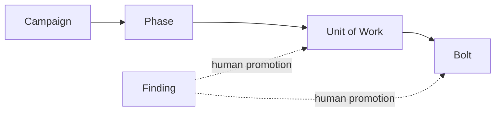

# AIDLC Delivery Conventions

This document defines how EmbodySense turns product direction into reviewable GitHub work while preserving human authority and allowing long autonomous intervals. It governs delivery structure, not product scope. `docs/OPINIONATED_PROJECT_AXIOMS.md` remains the product-direction authority.

## Active work taxonomy



| Level | Purpose | Children | Pull-request relationship | Exit decision |
| --- | --- | --- | --- | --- |
| Campaign | Durable product outcome spanning multiple phases | Phases only | Tracking only; never closed by a PR | Human confirms all phases and campaign evidence |
| Phase | Outcome and certification boundary | Units of Work only | Tracking only; never closed by a PR | Human reviews the phase rollup on exact `main` |
| Unit of Work (UOW) | Reviewable delivery outcome that can be accepted independently | Normally 2–8 Bolts; hard maximum 12 active Bolts | PRs may reference it with `Tracks`, not close it | All acceptance evidence and necessary Bolts are complete |
| Bolt | Smallest implementation unit with one coherent acceptance contract | None | Normally one PR; the only level a PR may close | Required checks and bounded review reach a terminal decision |
| Finding | One deduplicated review root cause awaiting disposition | None; parentless by default | Links to its origin PR and review evidence | Human rejects, defers, or promotes it to a UOW or Bolt |

The active hierarchy has at most three edges below a Campaign. GitHub may support deeper nesting, but this repository does not use it for active work. Closed historical subtrees may remain as evidence; do not add children to them or use them as active sequencing nodes.

## Label dimensions

Every open governed issue has exactly one label from each dimension:

- Work level: `work:campaign`, `work:phase`, `work:uow`, `work:bolt`, or `work:finding`.
- Nature: `type:feature`, `type:bug`, or `type:chore`.
- Domain: one `domain:*` label.
- State: one `status:*` label.

Campaigns, Phases, and active UOWs use `status:tracking`. A Bolt may progress through `status:needs-spec`, `status:queued`, `status:ready`, and `status:in-progress`; `status:deferred` means an owner intentionally postponed it. Closed issues carry no `status:*` label. `type:epic` is retired for active delivery because work level now expresses hierarchy independently from the nature of the work.

## Admission contracts

### Unit of Work

A UOW states one independently reviewable outcome, acceptance evidence, explicit non-goals, protected invariants, changed systems, known debt, native dependencies, required verification, and authority boundaries. It may enter tracking with fewer than two Bolts while being decomposed, but it cannot become ready or in progress without a sufficient Bolt plan.

Split a UOW when it exceeds 12 active Bolts, spans independently mergeable outcomes, requires different acceptance evidence, or crosses a material architecture or authority decision. Do not split merely to increase concurrency.

### Bolt

A Bolt owns one root behavior or delivery repair, a bounded changed surface, observable acceptance evidence, and normally one implementation PR. A Bolt never gains sub-issues. If implementation reveals another independently valuable outcome, pause and return it to UOW triage rather than recursively nesting work.

### Finding

A review finding is not automatically implementation work. Record one root cause, origin PR and comment, current-head evidence, material impact, duplicate search, why it is outside the current contract, acceptance criteria, and verification expectations. Keep it parentless with `work:finding` until weekend triage either rejects it, links it to existing work, promotes it to a Bolt, or groups it into a UOW.

## Native hierarchy and dependencies

GitHub's native parent and dependency relationships are authoritative. Body prose may explain a relationship but cannot replace it. Use parentage for ownership and `blocked by` for execution order; do not encode sequencing only in checklists or issue text.

A dependency should identify a necessary delivered prerequisite, not merely a preferred order. Cross-phase or out-of-phase blockers require explicit placement and a human-visible reason. Dependency cycles are invalid.

## Autonomous delivery circuit breakers

Each Bolt follows `$run-agentic-pr-pipeline`:

1. Record the change contract, intended base, authority, and required executable gates.
2. Implement the smallest coherent patch and pass repository gates before model review.
3. Request one stable full review, group findings by root cause, and batch accepted in-scope fixes.
4. Request one targeted re-review of the fix delta. A third targeted pass is allowed only for a new credible P0 or P1 introduced by the fixes.
5. Require human authorization for any later review pass, a fourth replacement implementation attempt, a material subsystem or architecture expansion, or merge.

P0/P1 findings normally return to the current PR. Concrete P2/P3 findings default to deduplicated parentless Finding issues when authorized. Unsupported, duplicate, stale, inherited, or already issue-linked observations create no new work.

The implementation loop ends as `READY`, `NEEDS-HUMAN`, `BLOCKED`, or `FAILED`. It does not keep opening replacement PRs or descendant issues to make visible progress. Merge, Phase completion, UOW acceptance, architecture alternatives, and exceptional budget extensions remain human decisions suitable for weekend review.

## Pull-request rules

- Target `main` unless an explicitly coupled stack has an exact immediate parent; state the coupling and merge order.
- Use `Fixes #...` only for the Bolt implemented by the PR. Use `Tracks #...` for its UOW and Phase.
- Keep one root-cause disposition ledger: `FIX-IN-PR`, `DEFER-ISSUE`, `NO-CHANGE`, or `DUPLICATE-STALE`.
- Record exact base/head SHAs and executable verification. A restack without a changed effective patch does not consume another review pass.
- Never merge without explicit user authority and a current green head.

## Read-only audit

Run the hierarchy audit from an authenticated checkout:

```powershell
./scripts/audit-issue-hierarchy.ps1 -Repository Jacob-J-Thomas/agenthome-poc -Campaign 332 -Phase 523
```

The audit reads GitHub state and fails on active hierarchy, label, body-parent, dependency-cycle, or PR-closing violations. It reports non-blocking decomposition warnings separately and never mutates an issue or pull request.
The repository workflow runs it on Saturday for weekend review and supports an explicit manual run; it intentionally does not launch a full-tree API audit for every individual issue edit.
