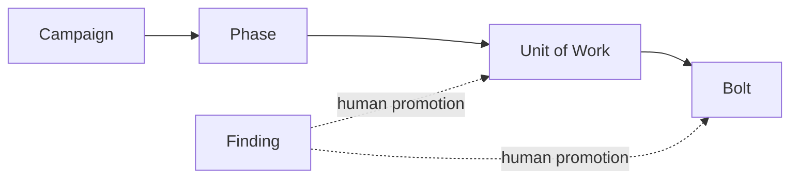

# AIDLC Delivery Conventions

This document defines how EmbodySense turns product direction into reviewable GitHub work while preserving human authority and allowing long autonomous intervals. It governs delivery structure, not product scope. `docs/OPINIONATED_PROJECT_AXIOMS.md` remains the product-direction authority.

## Active work taxonomy



| Level | Purpose | Children | Pull-request relationship | Exit decision |
| --- | --- | --- | --- | --- |
| Campaign | Durable product outcome spanning multiple phases | Phases only | Tracking only; never closed by a PR | Human confirms all phases and campaign evidence |
| Phase | Outcome and certification boundary | Units of Work only | Tracking only; never closed by a PR | Human reviews the phase rollup on exact `main` |
| Unit of Work (UOW) | Reviewable delivery outcome that can be accepted independently | Normally 2–8 Bolts; hard maximum 12 active Bolts | PRs may reference it with `Tracks`, not close it | All acceptance evidence and necessary Bolts are complete |
| Bolt | Smallest implementation unit with one coherent acceptance contract | None | Normally one PR; the only level a PR may close | Required checks and bounded review reach a terminal decision |
| Finding | One deduplicated review root cause awaiting disposition | None; parentless by default | Links to its origin PR and review evidence | Human rejects, defers, or promotes it to a UOW or Bolt |

The active hierarchy has at most three edges below a Campaign. GitHub may support deeper nesting, but this repository does not use it for active work. Closed historical subtrees may remain as evidence; do not add children to them or use them as active sequencing nodes.

## Label dimensions

Every open governed issue has exactly one label from each dimension:

- Work level: `work:campaign`, `work:phase`, `work:uow`, `work:bolt`, or `work:finding`.
- Nature: `type:feature`, `type:bug`, or `type:chore`.
- Domain: one `domain:*` label.
- State: one `status:*` label.

Campaigns, Phases, and active UOWs use `status:tracking`. A Bolt may progress through `status:needs-spec`, `status:queued`, `status:ready`, and `status:in-progress`; `status:deferred` means an owner intentionally postponed it. `status:blocked` means a human decision, authority grant, access change, credential, or requested input is required. Every blocked issue names the human action, the owner or authority, and the evidence that releases the issue. It never means that code, another issue, a check, or a retry must finish first. Closed issues carry no `status:*` label. `type:epic` is retired for active delivery because work level now expresses hierarchy independently from the nature of the work.

## Admission contracts

### Unit of Work

A UOW states one independently reviewable outcome, acceptance evidence, explicit non-goals, protected invariants, changed systems, known debt, technical prerequisites and intended order, required verification, and authority boundaries. It may enter tracking with fewer than two Bolts while being decomposed, but it cannot begin implementation without a sufficient Bolt plan.

Split a UOW when it exceeds 12 active Bolts, spans independently mergeable outcomes, requires different acceptance evidence, or crosses a material architecture or authority decision. Do not split merely to increase concurrency.

### Bolt

A Bolt owns one root behavior or delivery repair, a bounded changed surface, observable acceptance evidence, and normally one implementation PR. A Bolt never gains sub-issues. If implementation reveals another independently valuable outcome, pause and return it to UOW triage rather than recursively nesting work.

### Finding

A review finding is not automatically implementation work. Record one root cause, origin PR and comment, current-head evidence, material impact, duplicate search, why it is outside the current contract, acceptance criteria, and verification expectations. Keep it parentless with `work:finding` until weekend triage either rejects it, links it to existing work, promotes it to a Bolt, or groups it into a UOW.

## Native hierarchy, queueing, and human intervention

GitHub's native parent relationship is authoritative for ownership. Body prose may explain parentage but cannot replace it. Record technical prerequisites and intended order in each UOW or Bolt contract. An unmet technical prerequisite keeps a Bolt `status:queued`; it does not make the issue human-blocked.

Do not use GitHub's native `blocked by` relationship for technical sequencing because GitHub projects that relationship as a generic Blocked state. Cross-phase or out-of-phase prerequisites require explicit placement and a human-visible reason in the issue contract. Use `status:blocked` only when progress requires explicit human intervention, and record:

- Human action: the exact decision, authority, access, credential, or input required.
- Human owner: the person or authority that can provide it.
- Exit evidence: the observable evidence that releases the issue back to `status:queued`, `status:ready`, or `status:in-progress`.

A failed check, exhausted automated attempt, unavailable implementation dependency, or preferred execution order is not `status:blocked`. Handle it through bounded recovery, `status:queued`, or a `FAILED` handoff as appropriate.

## Autonomous delivery circuit breakers

Each Bolt follows `$aidlc-pipeline`:

1. Record the change contract, intended base, authority, and required executable gates.
2. Implement the smallest coherent patch and pass repository gates before model review.
3. Request one stable full review, group findings by root cause, and batch accepted in-scope fixes.
4. Request one targeted re-review of the fix delta. A third targeted pass is allowed only for a new credible P0 or P1 introduced by the fixes.
5. Require human authorization for any later review pass, a fourth replacement implementation attempt, a material subsystem or architecture expansion, or merge.

P0/P1 findings normally return to the current PR. Concrete P2/P3 findings default to deduplicated parentless Finding issues when authorized. Unsupported, duplicate, stale, inherited, or already issue-linked observations create no new work.

The implementation loop ends as `READY`, `QUEUED`, `BLOCKED`, or `FAILED`. `BLOCKED` is the human-intervention handoff and must name the required action, owner, and exit evidence. `QUEUED` covers unmet technical prerequisites or campaign position. It does not keep opening replacement PRs or descendant issues to make visible progress. Merge, Phase completion, UOW acceptance, architecture alternatives, and exceptional budget extensions remain human decisions suitable for weekend review.

## Pull-request rules

- Target `main` unless an explicitly coupled stack has an exact immediate parent; state the coupling and merge order.
- Use `Fixes #...` only for the Bolt implemented by the PR. Use `Tracks #...` for its UOW and Phase.
- Keep one root-cause disposition ledger: `FIX-IN-PR`, `DEFER-ISSUE`, `NO-CHANGE`, or `DUPLICATE-STALE`.
- Record exact base/head SHAs and executable verification. A restack without a changed effective patch does not consume another review pass.
- Never merge without explicit user authority and a current green head.

## Current-intent handoff

Long-running delivery work may keep one schema-1 handoff at `.aidlc/local/delivery-handoff.json`. The directory is repository-local and ignored. It records the current objective and work item, exact base/head and intended write set, provenance, protected worktree observations, the next action, and retained attempt, gate, and review counters.

Use the repository script to write, read, or check it:

```powershell
./scripts/delivery-handoff.ps1 -Operation Write -InputPath ./handoff-input.json -ExpectedDocumentSha256 absent
./scripts/delivery-handoff.ps1 -Operation Read
./scripts/delivery-handoff.ps1 -Operation Check -ApprovedProtectedWorktreePath /exact/authorized/worktree
```

Every update is a byte-hash compare-and-swap. Use the SHA-256 returned by Read or Check as `-ExpectedDocumentSha256`; a stale writer receives `cas_conflict` and cannot restore superseded instructions. The writer serializes bounded canonical JSON and replaces the file under an exclusive local lock. It does not claim universal power-loss durability on every filesystem.

All operations reject symlink or reparse-point escapes through `.aidlc`, `.aidlc/local`, the handoff, or its lock before reading or writing fixed local state. Document reads check file length before allocation and stop after a bounded 256 KiB plus one-byte growth probe. Check gives each Git query one two-second execution-and-drain deadline and caps each redirected stream at 64 KiB; a timeout, descendant-held pipe, or output overflow becomes unavailable local evidence and never returns captured output.

Before resuming work, run Check and revalidate its provenance against current user/session authority. `current` means only that the document agrees with the local repository, counters, recorded validity condition, and explicitly approved protected paths. The document always says `isAuthorityGrant: false` and `requiresIndependentRevalidation: true`; neither the file nor the script authenticates a user, grants permission, renews a budget, or executes the recorded next action.

Authority validity may use an explicit UTC expiry or last until the named goal is completed or the authority is revoked. Goal completion and revocation require an atomic handoff update with referenced evidence; they never arise from an invented calendar deadline. Ordinary review capacity is one full review and one targeted review. A third review for a newly introduced credible P0/P1 and a clinical recovery extension are separate inactive records that require their own operative decision and eligibility evidence.

Protected worktrees may belong to another clone. Check never scans directories or assumes they appear in the active clone's worktree list. It reads an external worktree only when the caller supplies that exact stored path through `-ApprovedProtectedWorktreePath`, then compares repository identity, HEAD, and a content-free status hash without modifying it.

The schema excludes environment maps, transcripts, tool-output blobs, commands, and credential fields. The writer redacts documented authorization headers, credential assignments, and recognized token shapes, but this is a bounded defense: regular expressions cannot identify every secret. Supply short metadata references only and never put secrets in a handoff. The script creates no issue, PR, task, scheduler, service, network request, or external side effect.

## Read-only audit

Run the hierarchy audit from an authenticated checkout:

```powershell
./scripts/audit-issue-hierarchy.ps1 -Repository Jacob-J-Thomas/agenthome-poc -Campaign 332 -Phase 523
```

The audit reads GitHub state and fails on active hierarchy, label, body-parent, native `blocked by`, human-intervention-contract, or PR-closing violations. It reports non-blocking decomposition warnings separately and never mutates an issue or pull request.
The repository workflow runs it on Saturday for weekend review and supports an explicit manual run; it intentionally does not launch a full-tree API audit for every individual issue edit.
